<div align="center">
  <h1>🛡️ AegisPay</h1>
  
  <p><i>Privacy-Preserving Payroll on Stellar Soroban</i></p>
  
  <p>
    
    
    
    
  </p>
</div>

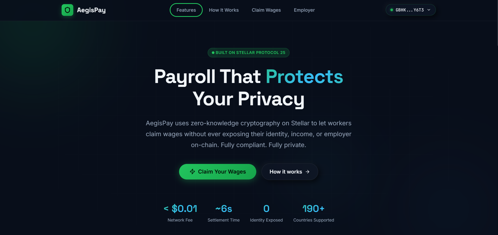

<br />

## Problem & Solution

**The Problem:** Global payroll on public blockchains exposes sensitive salary data to the entire world. Employers want the efficiency and borderless nature of crypto payroll, but they cannot afford to leak individual employee compensations or identities on-chain. Conversely, employees want cryptographic guarantees that their wages are locked in escrow and claimable without friction.

**The Solution:** AegisPay leverages **Zero-Knowledge Proofs (zk-SNARKs)** and the **Stellar Soroban** smart contract platform to create a completely private payroll system. Employers fund a single, opaque escrow pool. Employees generate a cryptographic proof in their browser and claim their exact wage from the pool, entirely shielding their identity and salary amount from the public ledger.

---

## Purpose

To bridge the gap between enterprise privacy requirements and public blockchain efficiency, providing a secure, trustless, and zero-knowledge payroll distribution system for the modern remote workforce.

---

## Value Proposition

### Why This is Revolutionary / Key Advantages
* **Absolute Privacy:** Wage amounts and worker identities remain entirely off-chain and hidden via zk-SNARKs.
* **Gasless for Workers:** Utilizing a relayer architecture, workers do not need to hold XLM to pay for transaction fees to claim their wages.
* **Cryptographic Guarantees:** Once the employer funds the contract and updates the Merkle Root, the funds are mathematically guaranteed to be claimable by the authorized workers.

### Competitive Advantage / Comparison
Unlike traditional crypto payroll solutions (like Sablier or standard multisig distributions) that broadcast every recipient address and amount to the blockchain, AegisPay consolidates all funds into a single contract. Only the cryptographic footprint (a Nullifier) is recorded on-chain when a worker is paid.

### Ecosystem / Technology Advantage
* **Stellar Network:** Offers lightning-fast settlement times (3-5 seconds) and fractions of a cent in transaction fees, making micro-payroll feasible.
* **Soroban Smart Contracts:** Built in Rust, offering a safe, predictable, and highly performant execution environment for complex cryptographic verification.
* **SEP-31 Anchors:** Seamlessly integrates with Stellar's global network of fiat anchors, allowing workers to receive local fiat directly into their bank accounts.

---

## Product Mechanics

### How The System Works (Step-by-Step)
1. **Upload:** The Employer uploads a standard CSV file containing Worker IDs and their USD wage amounts to the Employer Dashboard.
2. **Convert & Commit:** The system fetches the live XLM/USD price, converts the wages, builds a Merkle Tree, and generates individual `.json` claim files for each worker.
3. **Fund Escrow:** The Employer deposits the total required XLM into the Soroban Smart Contract and sets the active Merkle Root.
4. **Distribute:** The Employer securely sends the individual `.json` claim files to their respective employees off-chain (e.g., via email).
5. **Generate Proof:** The Employee uploads their claim file to the AegisPay Worker UI. The UI generates a Groth16 zk-SNARK proof **locally in the browser** (no sensitive data leaves the device).
6. **Redeem & Route:** The Employee submits the proof (via a relayer) to the Soroban contract. The contract verifies the proof, checks that the nullifier hasn't been used, and routes the XLM to the worker's specified SEP-31 Anchor address for fiat conversion.

### Target Users
* **Global Enterprises & DAOs:** Organizations that need to pay contractors globally with crypto without doxxing their payroll sheet.
* **Remote Workers & Freelancers:** Individuals who want fast, guaranteed payouts routed directly to their local bank accounts.

### Features
* 🔄 **Live USD to XLM Conversion:** Real-time pricing oracle integration via CoinGecko.
* 🌳 **Merkle Tree Generation:** Efficiently compresses thousands of payroll records into a single 32-byte root.
* 🛡️ **In-Browser ZK Proving:** WASM-compiled Circom circuits run entirely client-side.
* 🚫 **Idempotency (Double-Spend Protection):** Cryptographic nullifiers ensure a claim file can only be redeemed once.

---

## Screenshots

* **Wallet Connected State:**
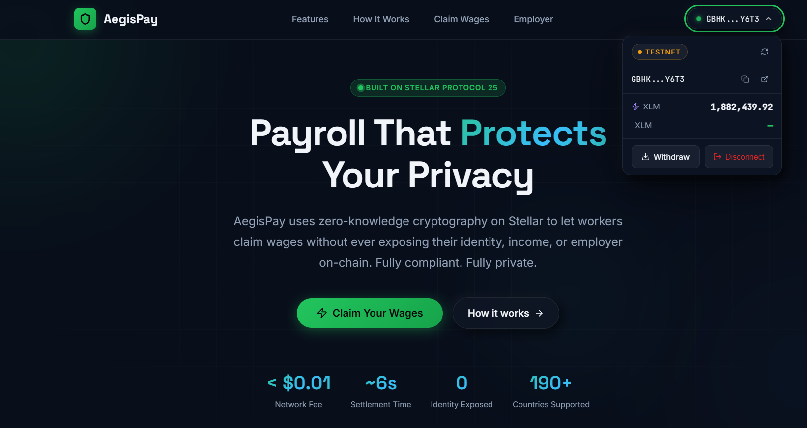

* **Balance Displayed:**
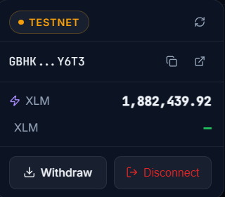

* **Successful Transaction Result:**
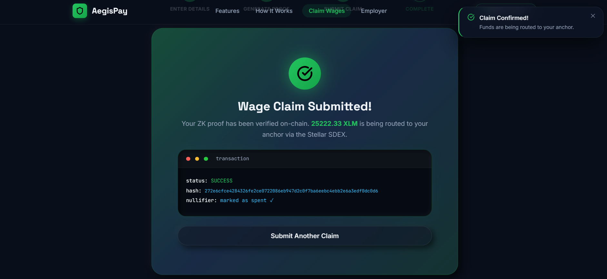

* **Wallet Options:**
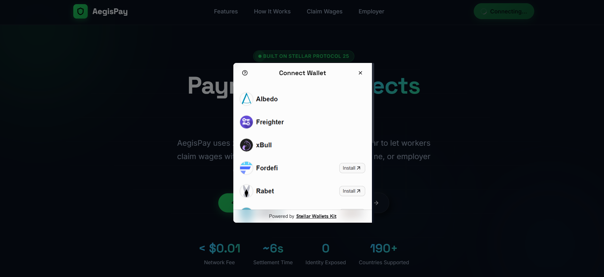

* **Mobile View:**
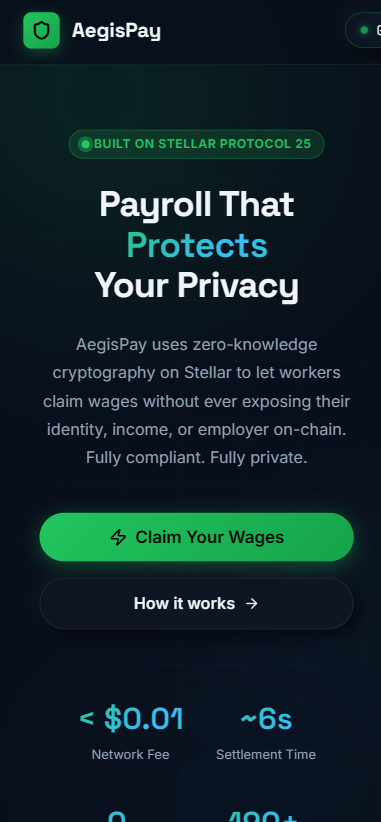

* **Analytics:**
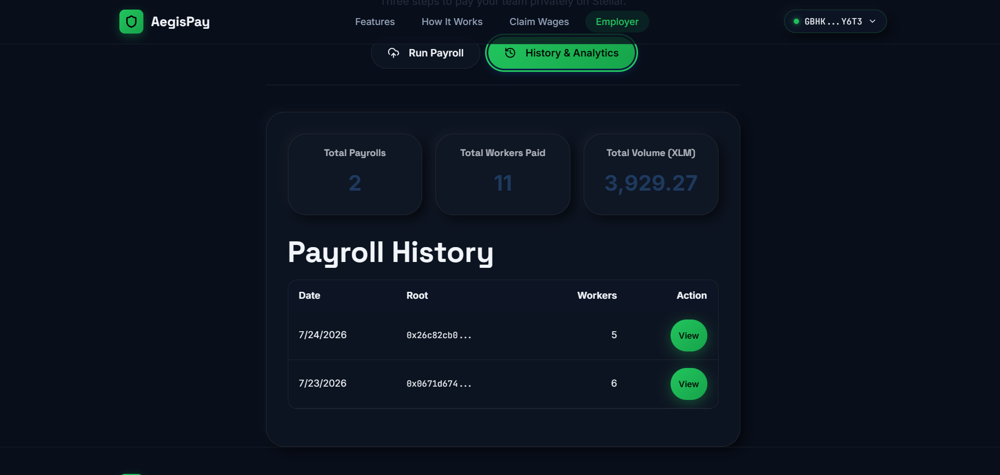

* **CI/CD Pipeline:**
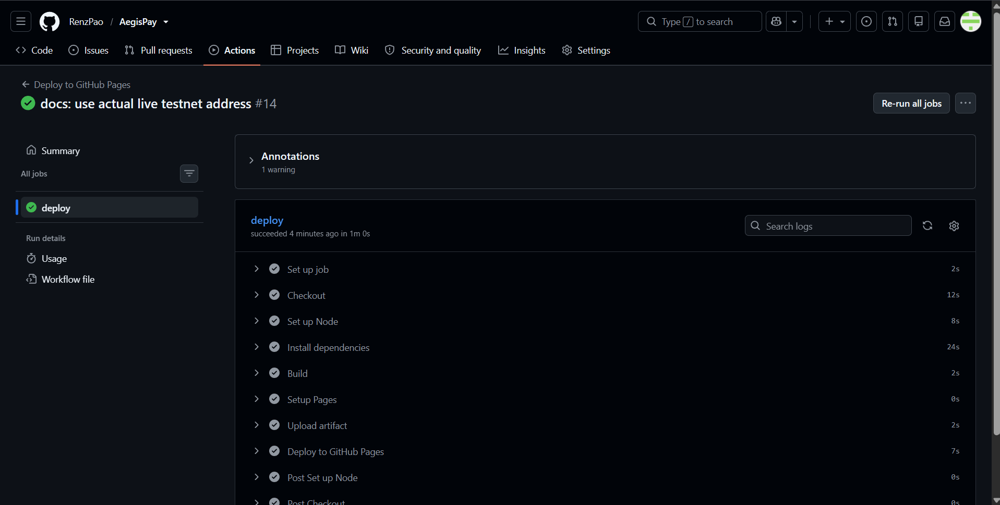

* **Test Output:**
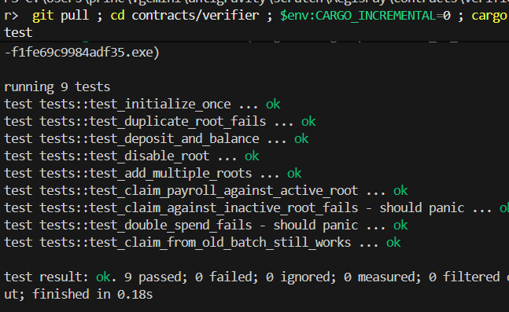

---

## Engineering & Architecture

### Tech Stack
* **Frontend:** React, TypeScript, Vite, Framer Motion
* **Cryptography:** SnarkJS, Circom (BN254 Groth16)
* **Smart Contract:** Rust (Soroban SDK)
* **Blockchain Integration:** `@stellar/stellar-sdk`, `@stellar/freighter-api`

### Live Demo & Testnet Details
* **Live Demo:** [https://renzpao.github.io/AegisPay/](https://renzpao.github.io/AegisPay/)
* **Contract Address:** [`CC6QLF4DI7C6LKURR2V7XQOZ72BNG5BOKURQ2SYQHPTAZEHO7PLRMR5K`](https://stellar.expert/explorer/testnet/contract/CC6QLF4DI7C6LKURR2V7XQOZ72BNG5BOKURQ2SYQHPTAZEHO7PLRMR5K)
* **Transaction Hash:** [`e2105673626ac4aade91e70f6fad328b9ff57b053c07b2f1a55c059724dbbe0d`](https://stellar.expert/explorer/testnet/tx/e2105673626ac4aade91e70f6fad328b9ff57b053c07b2f1a55c059724dbbe0d)
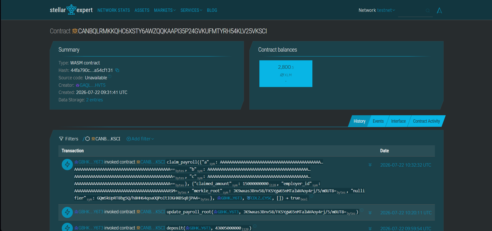

### Architecture

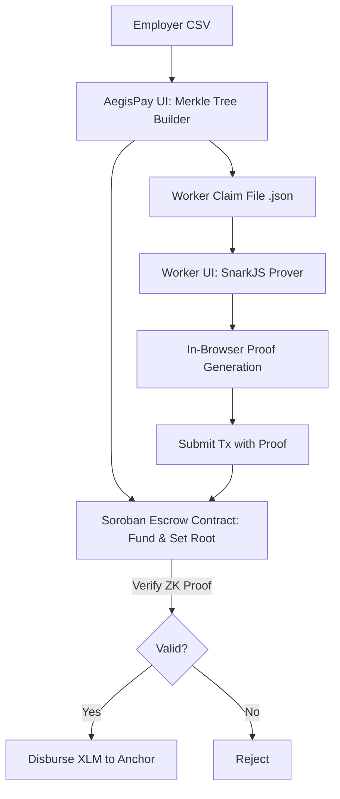

### Advanced Technical Implementation (Deep Dive)
**Zero-Knowledge Smart Contract Verification:** 
AegisPay utilizes the Groth16 proving system. The BN254 elliptic curve cryptography is evaluated on-chain inside the Soroban Rust contract. We had to implement a custom XDR struct encoder in the frontend (`createStructScVal`) to correctly alphabetize and format the `Proof` and `PublicInputs` structs into Soroban `scvSymbol` mapped arrays to allow the contract's host environment to safely unpack and verify the SNARK.

---

## Project Lifecycle & Usage

### Prerequisites & Local Installation

| Dependency | Version | Notes |
| :--- | :--- | :--- |
| Node.js | v18+ | Required for the frontend |
| Rust | 1.80+ | Required for Soroban contracts |
| Stellar CLI | latest | For local network deployment |

```bash
# 1. Clone the repository
git clone https://github.com/RenzPao/AegisPay.git
cd AegisPay

# 2. Start the Frontend
cd frontend
npm install
npm run dev

# 3. Build the Smart Contract (Optional)
cd ../contracts/verifier
soroban contract build
```

---

## License

This project is licensed under the MIT License - see the LICENSE file for details.
